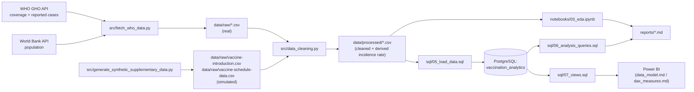

# Architecture

## Pipeline overview

## Component responsibilities

| Component | Responsibility |
|---|---|
| `src/fetch_who_data.py` | Pull real coverage, reported-case, and population data from public APIs |
| `src/generate_synthetic_supplementary_data.py` | Produce the two datasets WHO doesn't expose via API, clearly labeled |
| `src/data_loader.py` | Thin CSV-reading wrapper, single source of truth for file paths (`src/config.py`) |
| `src/data_cleaning.py` | One `clean_*` function per dataset; also derives `incidence_rate` |
| `src/validation.py` | Post-cleaning schema/range/consistency checks, used by tests and ad hoc |
| `src/transformations.py` | Shared statistical formulas (correlation, YoY change, dose drop-off, etc.) used by both the notebook and reports |
| `notebooks/01_data_audit.ipynb` | Phase-0 inspection of the raw files before any cleaning |
| `notebooks/02_data_cleaning.ipynb` | Runs the cleaning pipeline and demonstrates the documented decisions |
| `notebooks/03_eda.ipynb` | Full exploratory analysis, answers the brief's feasible questions |
| `sql/01`–`07` | Database creation, schema, constraints, indexes, load, analysis queries, BI views |
| `powerbi/*.md` | Data model, DAX measures, and dashboard spec (no `.pbix` — see `powerbi/README.md`) |
| `reports/*.md` | Data-quality, EDA findings, question-by-question analysis results, public-health insights |
| `docs/*.md` | This file, methodology, data dictionary, database schema, limitations |
| `tests/` | pytest coverage for cleaning, validation, and transformation logic |

## Why this shape

Each stage writes its output to disk (`data/raw/` → `data/processed/` →
SQL tables / notebook outputs / reports) rather than passing DataFrames
in memory across scripts, so any stage can be re-run independently and
inspected without re-running the whole pipeline — useful given that the
fetch step depends on live network APIs that could be temporarily
unavailable.
