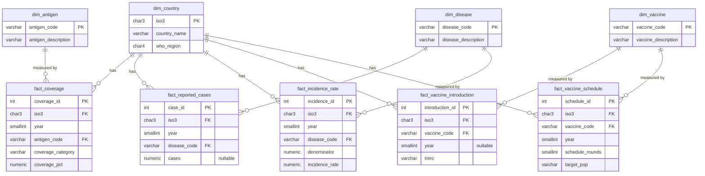

# Database Schema

PostgreSQL, defined in `sql/01`–`04`, loaded by `sql/05`, queried by
`sql/06`, and exposed to BI tools through the views in `sql/07`. See
`docs/methodology.md` for why this normalization was chosen.

## Why star-schema, not one table per CSV

`Name`/`Country_Name` and `WHO_Region` each appear in 4 of the 5 raw
files. Storing them once in `dim_country` and referencing `iso3`
everywhere else means a country's name is corrected in exactly one place
if it ever needs to be, and every fact table joins to the same 234-row
dimension instead of carrying its own copy of country metadata.

## Grain of each fact table

| Table | Grain | Matches cleaning dedup key in `src/data_cleaning.py`? |
|---|---|---|
| fact_coverage | country × year × antigen × coverage_category | Yes |
| fact_reported_cases | country × year × disease | Yes |
| fact_incidence_rate | country × year × disease | Yes |
| fact_vaccine_introduction | country × vaccine | Yes |
| fact_vaccine_schedule | country × vaccine × year | Yes |

Keeping the SQL `UNIQUE` constraints (`03_constraints.sql`) aligned with
the Python-side dedup keys means a loading bug would surface as a
constraint violation at load time, not as silent double-counting in a
later query.

## Constraints summary

- **Primary keys**: surrogate `SERIAL` on every fact table (a natural
  composite key is already enforced via `UNIQUE`, but a single-column PK
  keeps foreign keys from downstream tables simpler, should any be added).
- **Foreign keys**: every fact table's `iso3` references `dim_country`;
  antigen/disease/vaccine codes reference their respective dimension.
- **Checks**: coverage percentage bounded [0, 100], year bounded
  [1974, 2026], case counts non-negative, incidence rate non-negative,
  denominator positive, schedule rounds positive, WHO region restricted
  to the 6 known codes, and an internal-consistency check that
  `fact_vaccine_introduction.year` is non-null whenever `intro = 'YES'`.

## Known limitation: not executed against a live PostgreSQL instance

PostgreSQL was not installed in the environment this project was built
in. Every table's structure was written directly from the cleaned CSV
schemas (`docs/data_dictionary.md`), and every query in
`sql/06_analysis_queries.sql` was logic-validated by loading the same
real cleaned data into an equivalent SQLite schema and confirming its
output (see `docs/methodology.md`) — but the `.sql` files themselves have
not been executed against a real PostgreSQL server. Running
`sql/01`–`05` against a real instance before relying on this schema in
production is recommended.
